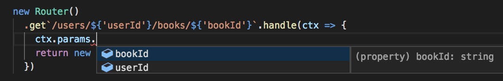
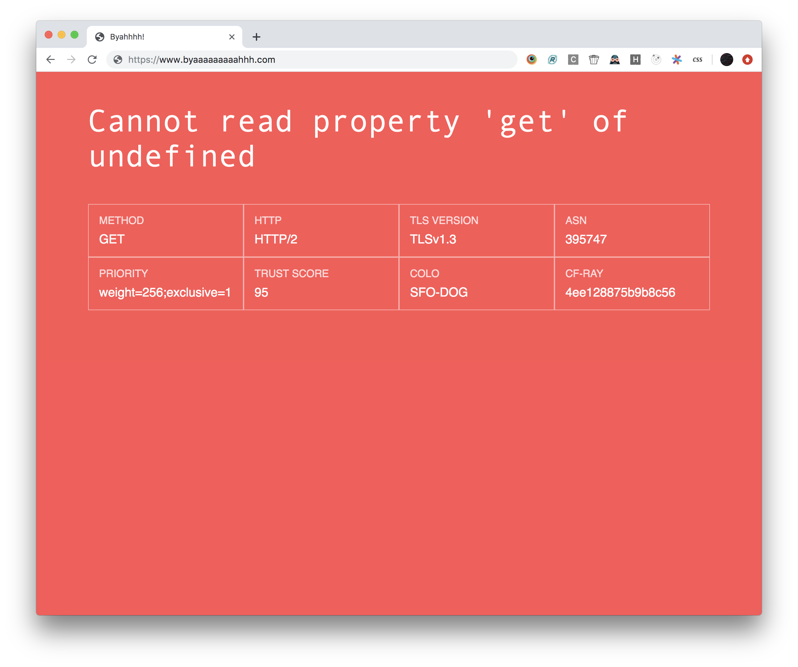
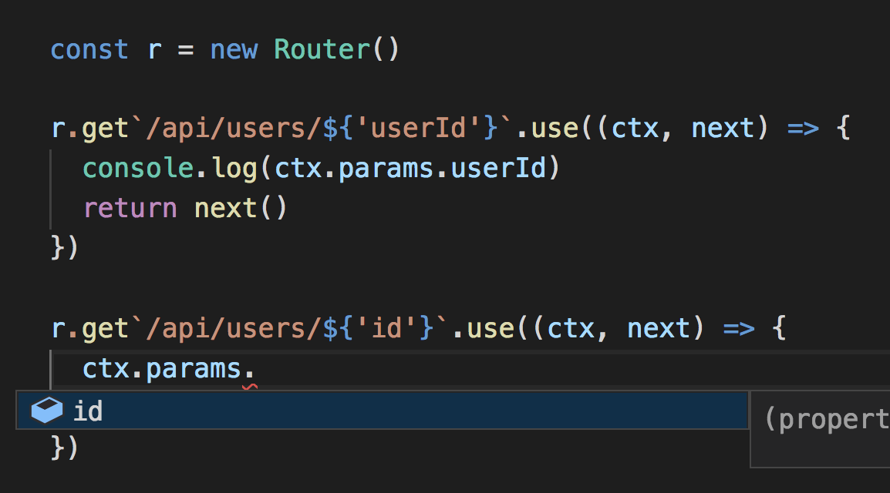

# 8Track - A Service Worker Router

<p align="center"></p>
<p align="center">Wanted: a better logo</p>

> A service worker router with async middleware and neato type-inference inspired by Koa



#### Installation

```
npm install -S 8track
-- Or yarn
yarn add 8track
```

##### TypeScript

This library is written in TypeScript, so typings are bundled.

#### Basic usage Usage

```typescript
import { Router } from '8track'

const router = new Router()

router.all`(.*)`.use(async (ctx, next) => {
  const url = new URL(ctx.request.url)
  console.log(`Handling ${ctx.request.method} - ${url.pathname}`)
  await next()
  console.log(`${ctx.request.method} - ${url.pathname}`)
})

router.get`/`.handle(ctx => ctx.html('Hello, world!'))

router.all`(.*)`.handle(ctx => ctx.end('Not found', { status: 404 }))

addEventListener('fetch', (e: FetchEvent) => {
  e.respondWith(router.getResponseForEvent(e))
})
```

## Examples

#### Add CORS headers

```typescript
import { Router } from '8track'

const router = new Router()

router.all`(.*)`.use(async (ctx, next) => {
  const allowedOrigins = ['https://www.myorigin.com']
  const allowedHeaders = ['Content-type', 'X-My-Custom-Header']
  const allowedMethods = ['GET', 'HEAD', 'PUT', 'POST', 'DELETE', 'PATCH']

  ctx.response.headers.add('Vary', 'Origin')
  ctx.response.headers.add('Access-Control-Allow-Origin', allowedOrigins.join(',))
  ctx.response.headers.add('Access-Control-Allow-Headers', allowedHeaders.join(','))
  ctx.response.headers.add('Access-Control-Allow-Methods', allowedMethods.join(','))
  ctx.response.headers.add('Access-Control-Allow-Credentials', 'true')

  if (ctx.req.method === 'OPTIONS') {
    return ctx.end('', { status: 204 })
  }

  await next()
})
```

#### Catch all errors and display error page



```typescript
import { Router, getErrorPageHTML } from '8track'

const router = new Router()

addEventListener('fetch', e => {
  const res = router.getResponseForEvent(e).catch(
    error =>
      new Response(getErrorPageHTML(e.request, error), {
        status: 500,
        headers: {
          'Content-Type': 'text/html',
        },
      }),
  )

  e.respondWith(res as any)
})
```

#### Attach new properties to each request

Each Middleware and route handler receives a new copy of the ctx object, but a special object under the `data` property is mutable and should be used to share data between handlers

```typescript
interface User {
  id: string
  name: string
}

// Pretend this is a function that looks up a user by ID
async function getUserById(id: string): Promise<User | undefined> {
  return null as any
}

// The describes the shape of the shared data each middleware will use
interface RouteData {
  user?: User
}

// This middleware attaches the user associated to the route to the request
const getUserMiddleware: Middleware<RouteData, { userId: string }> = async (ctx, next) => {
  ctx.data.user = await getUserById(ctx.params.userId)
  await next()
}

const router = new Router<RouteData>()

// For all user requests, attach the user
router.all`/users/${'userId'}`.use(getUserMiddleware)

router.get`/users/${'userId'}`.handle(ctx => {
  if (!ctx.data.user) return ctx.end('Not found', { status: 404 })
  ctx.json(JSON.stringify(ctx.data.user))
})
```

## API

### Router<RouteData>

Instantiate a new router

```typescript
const router = new Router<{ logger: typeof console.log }>()
```

#### .getResponseForEvent(request: FetchEvent): Promise<Response> | undefined

Given an event, run the matching middleware chain and return the response returned by the chain.

#### Router handlers and middleware

The primary way to interact with the router is to add routes via method tags:

```typescript
router.post`/api/users`.handle(ctx => ctx.json({ id: 123 }))
```

In the above example, the `post` tag returns a [RouteMatchResult](#routematchresult) object.

##### Method Matchers

Each of these methods returns a [RouteMatchResult](#routematchresult) object.

- .all\`pattern\`
- .get\`pattern\`
- .post\`pattern\`
- .put\`pattern\`
- .patch\`pattern\`
- .delete\`pattern\`
- .head\`pattern\`
- .options\`pattern\`

### RouteMatchResult

When you use a template tag on the router, you create a RouteMatchResult.

```typescript
router.patch`/api/users/${'id'}` // RouteMatchResult
```

The RouteMatchResult object allows you to mount a route handler or a middleware that only runs when the pattern is matched.

```typescript
router.patch`/api/users/${'id'}`.use(async (ctx, next) => {
  console.log('Before: User ID', ctx.params.id)
  await next()
  console.log('After: User ID', ctx.params.id)
})
```

#### .handle((ctx: Context) => any)

Mount a route handler that should return an instance of Response

#### .use((ctx: Context, next: () => Promise<void>) => any)

Mount a route middleware that can optionally terminate the chain early and handle the request.

```typescript
router.patch`/api/users/${'id'}`.use(async (ctx, next) => {
  console.log('Before: User ID', ctx.params.id)

  if (ctx.params.id === '123') {
    return ctx.end(Response.redirect(302))
  }

  await next()

  console.log('After: User ID', ctx.params.id)
})
```

##### What's up with that weird syntax?

8track uses a JavaScript feature called [tagged templates](https://developer.mozilla.org/en-US/docs/Web/JavaScript/Reference/Template_literals#Tagged_templates) in order to extract parameter names from url patterns. TypeScript is able extract types from tagged template literals:

```typescript
const bar = 123
const baz = new Date()

// Extracted type here is a tuple [number, Date]
foo`testing: ${bar} - ${baz} cool`

// But things get interesting when using literal types
// Extracted type here is a tuple ['bar', 'baz']
foo`testing: ${'bar'} - ${'baz'} cool`
```

Since the template literal is able to extract a tuple whose types are the _literal values_ passed in, we can utilize generics to describe the shape of the route parameters:



## Built-in Middleware

### KV Static

Serves files from Cloudflare KV.

```typescript
import { Router, kvStatic } from '8track'

const router = new Router()

router.all`(.*)`.use(kvStatic({ kv: myKvNamespaceVar, maxAge: 24 * 60 * 60 * 30 }))
```

## Deploying your worker

8track comes with a CLI to upload your worker and sync your kv files. In order to use 8track's kv [static file middleware](#kv-static), you must upload your files using this CLI.

Add a deploy script to your package.json:

```javascript
{
  "scripts": {
    "deploy": "8track deploy --worker dist/worker.js --kv-files dist/client.js,dist/client.css"
  }
}
```

**Note**: This does not support globs yet!

You'll need the following environment variables set:

```bash
# Your Cloudflare API Token
CF_KEY
# Your Cloudflare account email
CF_EMAIL
# Your Cloudflare account ID
CF_ID
# The ID of the namespace
KV_NAMESPACE_ID
# The name of the KV namespace you want to use
KV_NAMESPACE
# The variable name your KV namespace is bound to
KV_VAR_NAME
```
